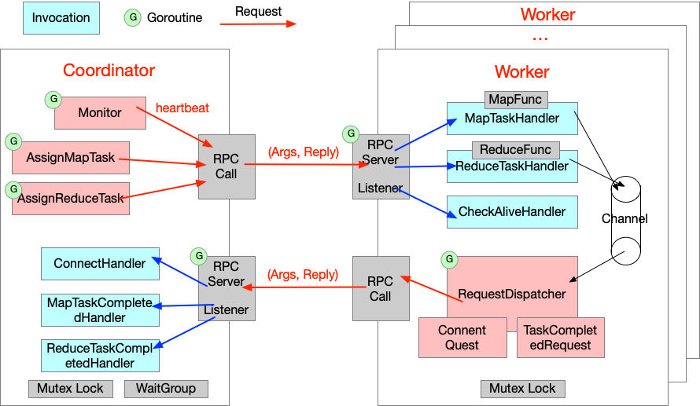

#  MapReduce: Simplified Data Processing on Large Clusters

## Project Overview

<div align="center">
    
</div>

## Documentation

- Libary
    - [labgob](./docs/doc-lib-labgob.md/)
    - [labrpc](./docs/doc-lib-labrpc.md/)
    - [logger](./docs/doc-lib-logger.md/)
    - [deepcopy](./docs/doc-lib-deepcopy.md/)

- Architecture
    - [mapreduce](./docs/doc-arch-mapreduce.md/)
    - [raft](./docs/doc-arch-raft.md/)

- Application
    - [kvraft](./docs/doc-app-kvraft.md/)

- Others
    - [configs](./docs/doc-configs.md/)


## Algorithms

### Project‘s Catalogue:

```shell
.
|-- mr // mapreduce libary
|-- mrapp // application for mapreduce
|-- main // start up a mapreduce
|-- raft // raft libary
|-- kvraft // kv service
|-- labrpc // rpc libary
|-- labgob // gob libary
|-- config // hyper-parameter
|-- utils // logger, deepcopy,..
`-- script // dstest, dslogs
```

### MapReduce

*A. Progress*

- worker count test. PASS
- job count test. PASS
- early exit test. PASS
- indexer test. PASS
- map parallelism test. PASS
- reduce parallelism test. PASS
- crash test. NO

*B. Debug*

```go
log.Pirntln("...")
log.Printf("...")
```


## Reference

- [MIT 6.5840 Distributed System](https://pdos.csail.mit.edu/6.824/schedule.html)
- [GO](https://tour.go-zh.org/welcome/1)
